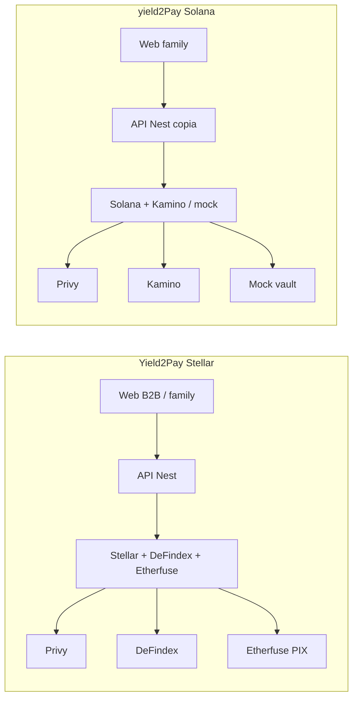
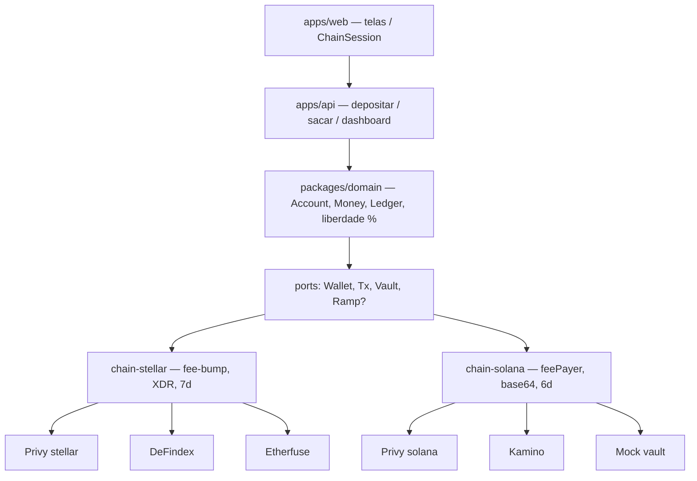
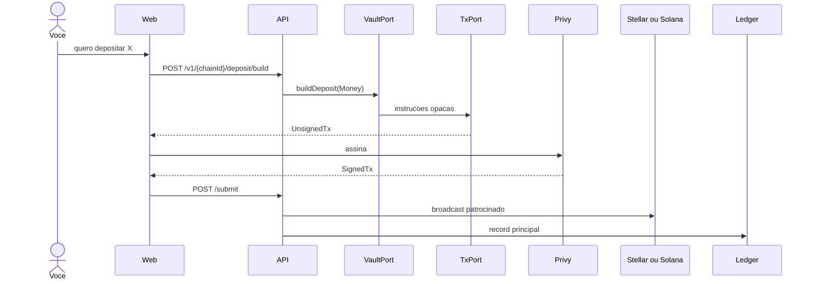

# Yield2Pay — estudo e arquitetura multichain

Estudo dos repositórios [Yield2Pay (Stellar)](https://github.com/Tiago-Alcantara/Yield2Pay) e [yield2Pay-solana](https://github.com/Tiago-Alcantara/yield2Pay-solana), e o desenho para um único código que fale as duas chains.

## Veredito

É possível, e não exige um contrato/programa Yield2Pay próprio no primeiro corte.

Os dois repos já são **o mesmo produto**: depósito não-custodial → cofre DeFi de terceiros → `spendable = vaultValue − principal` → lista de assinaturas por prioridade → Percentual de Liberdade. O que foi copiado e reescrito foi a **borda da chain**: envelope da transação, decimais, `chainType` do Privy, vendor do cofre e (só na Stellar) ramp PIX.

Multichain, neste contexto, significa:

1. Um núcleo de domínio sem SDK de chain.
2. Ports estáveis (`Wallet`, `Tx`, `Vault`, `Ramp?`).
3. Um adapter por rede.
4. Ledger e carteira **por chain**, com agregação só na UI.

Não significa um vault cross-chain, nem um USDC canônico misturando 6 e 7 casas decimais, nem unificar XDR com `VersionedTransaction`.

**Repo-base recomendado:** `yield2Pay-solana`. A vertical famílias lidera o produto, o tenant (`Household` + `Member` + `Sub.priority`) está mais perto do destino, e o `VaultService` já é uma interface. A Stellar entra como `packages/chain-stellar`, trazendo DeFindex + Etherfuse.

---

## 1. O que cada repo é hoje

### 1.1 Stellar — `Tiago-Alcantara/Yield2Pay`

- Monorepo pnpm: `apps/web` (Next 16), `apps/api` (Nest 11), `packages/shared`.
- Auth: Privy Google + carteira embedded `chainType: 'stellar'`.
- Tenant: `Company` 1:1 com `privyUserId`.
- Dinheiro: BigInt, **7 decimais**.
- Cofre: **DeFindex** (`@defindex/sdk`), estratégia Blend USDC no script `create-usdc-vault.js`. Não há contrato Soroban próprio no repo.
- Tx: API monta XDR, cliente assina o hash (`signRawHash`), sponsor faz **fee-bump**.
- Ramp: **Etherfuse** PIX ⇄ USDC (claim/burn XDR, KYC).
- UI B2B (`/dashboard`, `/deposit`, `/withdraw`) ligada à API. `/family` é protótipo local, fora do AuthGate.
- Bills: CRUD. **Ninguém paga vendor com yield.**

Arquivos-chave: `apps/api/src/vault/vault.service.ts`, `stellar/stellar.service.ts`, `ledger/ledger.service.ts`, `ramp/ramp.service.ts`, `apps/web/src/lib/useStellarTx.ts`, `useWallet.ts`.

### 1.2 Solana — `Tiago-Alcantara/yield2Pay-solana`

- Mesma forma de monorepo, mesmos padrões de erro e dashboard `SpendableView`.
- Tenant: `Household` + `Member`. Assinaturas com `priority`.
- Dinheiro: BigInt, **6 decimais**.
- Cofre: interface `VaultService` → `KaminoVaultService` (mainnet) ou `MockVaultService` (devnet 1:1). Kamino **não** roda em devnet (oracle Scope).
- Tx: sponsor é o **feePayer** de um `VersionedTransaction` v0, assinado em duas partes.
- Ramp: inexistente. Depósito SPL direto (`UsdcDepositCard`).
- `/family` plugado na API (onboarding, depósito, saque, dashboard).
- Subs: CRUD + ordem. **Mesmo buraco de pagamento.**
- `VaultPosition` no Prisma não é escrito em runtime. `DEMO_YIELD_BPS` infla o yield em demo. Comentário no ledger: principal chegou a ser lido da posição on-chain porque o registro no DB falhava — isso apaga o yield se virar regra.

Arquivos-chave: `apps/api/src/vault/vault.service.ts`, `solana/solana.service.ts`, `ledger/ledger.service.ts`, `apps/web/src/lib/useSolanaTx.ts`.

### 1.3 Fluxo de dinheiro (os dois)

```
fiat? ──ramp?──► stablecoin na carteira do usuário
                      │
                      │ tx patrocinada, assinada no Privy
                      ▼
                 cofre de terceiros (DeFindex | Kamino | mock)
                      │
           vaultValue cresce (ou é inflado no demo)
                      │
         spendable = vaultValue − Σ depósitos no DB
                      │
         ★ pagar Netflix com spendable: NÃO IMPLEMENTADO ★
                      │
                 saque do cofre ──► carteira ──ramp?──► fiat
```

Não-custodial nos dois: Yield2Pay nunca guarda a chave do usuário. Só a tesouraria (`FEE_SPONSOR_SECRET_KEY`) paga taxa / aluguel / reserva.

---

## 2. O que é de domínio e o que é de chain

| Camada | Compartilhar | Isolar no adapter |
|--------|----------------|-------------------|
| Produto | Liberdade %, cobertura por prioridade, `familyMath` | Copy de “Stellar” / “Solana” na landing |
| Auth | Privy JWT → Account | `createWallet({ chainType })` |
| Ledger | fórmula spendable, snapshots, cap de depósito | `txHash` vs `txSignature`, 6 vs 7 decimais |
| Vault | “depositar / sacar / APY / posição” | DeFindex XDR vs ixs Kamino vs mint/burn mock |
| Tx | build → sign → submit | fee-bump vs feePayer |
| Ramp | “ligar PIX se a chain tiver” | Etherfuse claimable balance |
| Conta | Account + Members opcionais | endereço nativo |

---

## 3. Arquitetura alvo

### Desenho — hoje (dois forks)



### Desenho — alvo (um nucleo)



### Desenho — um deposito



```
apps/web                telas + ChainSession + useChainTx
        │
apps/api                casos de uso (Nest)
        │
packages/domain         Account, Money, Ledger, Freedom
packages/shared         DTOs (UnsignedTx discriminado, SpendableView)
packages/chain-core     WalletPort, TxPort, VaultPort, RampPort, ChainAdapter
packages/chain-stellar  Stellar RPC, fee-bump, DeFindex, Etherfuse
packages/chain-solana   web3.js, sponsor feePayer, Kamino, MockVault
```

Regra: **`packages/domain` e `apps/web` não importam `@stellar/stellar-sdk`, `@defindex/sdk`, `@solana/web3.js` nem `@kamino-finance/klend-sdk`.**

Um `ChainRegistry` no Nest resolve `chainId → ChainAdapter`. Os controllers passam a ser `/v1/:chainId/deposit/build` (ou header `X-Chain-Id`). Uma Account pode ter carteira Stellar **e** Solana.

### 3.1 Money

Nunca persistir “USDC” sem decimais e chain.

```ts
type Money = {
  amount: bigint;
  decimals: number;
  asset: "USDC" | "BRL_MOCK";
  chainId: "stellar" | "solana";
};
```

Operações de ledger são **intra-chain**. Soma cross-chain só depois de converter para uma moeda de display (BRL/USD) com FX explícito — e só na UI / relatório, não no livro-razão.

### 3.2 Transação opaca

```ts
type UnsignedTx =
  | { chain: "stellar"; xdr: string; hash: string }
  | { chain: "solana"; transactionBase64: string };
```

O frontend faz switch só no signer do Privy. O restante do fluxo (loading, erro, `TxResultCard`) é único.

### 3.3 VaultPort

Copiar o formato da Solana (já abstrato) e fazer a Stellar caber nele.

- `buildDeposit` / `buildWithdraw` devolvem um payload **opaco para o TxPort do mesmo adapter**, não para a UI.
- `getPositionValue` devolve `Money`.
- `provider` é string (`defindex` | `kamino` | `mock`) para o dashboard técnico, não para o domínio.

Vários vaults na mesma chain são N implementações do mesmo port, escolhidas por env (`VAULT_PROVIDER`), como já existe na Solana.

### 3.4 RampPort (opcional)

`ChainAdapter.ramp?: RampPort`. Stellar implementa. Solana omite → a UI mostra depósito on-chain. Quando houver ramp Solana, ninguém no domínio muda.

### 3.5 Posição e liberdade

- **Fonte de verdade do cofre:** RPC / SDK (`getPositionValue`).
- **Fonte de verdade do principal:** soma das `LedgerEntry` daquela chain (depósito positivo, saque negativo).
- **Spendable:** `max(0, vault − principal)`, por chain.
- **Liberdade total (UI):** soma de rendimentos mensais estimados / soma de mensalidades. As mensalidades são off-chain; não precisam de chainId. O rendimento estimado vem das posições ativas.

Não criar um “vault lógico” que misture Stellar e Solana. O usuário pode ter 30% de liberdade numa chain e 70% na outra; o produto decide se mostra os dois anéis ou um só anel agregado.

---

## 4. Modelo de dados alvo

| Model | Papel |
|-------|--------|
| `Account` | `privyUserId`, `kind: family \| company` |
| `Member` | pessoas da família (opcional) |
| `Wallet` | `(accountId, chainId, address)`, `extras Json` (ATA, etc.) |
| `Position` | espelho do cofre por chain (escrever de verdade no sync) |
| `LedgerEntry` | `amount + decimals + asset + chainId + txRef` |
| `Subscription` | custo em Money de *display* (BRL ou USDC, uma unidade de produto) |
| `YieldSnapshot` | por `accountId + chainId` |
| `RampOrder` | opcional, `chainId` |

Assinaturas **não** são on-chain. Elas são a meta do PaymentEngine futuro. Precisam de uma unidade de cobrança (BRL no Brasil). Converter yield USDC → BRL na hora do payout, não no cadastro, se o produto continuar cotado em reais.

---

## 5. Frontend

Substituir:

- `useStellarTx` / `useSolanaTx` → `useChainTx`
- `RegisterWalletDto.stellarAddress` / `solanaAddress` → `{ chainId, address }`
- `PrivyProviderWrapper` único, com as chains habilitadas no config
- Cards de depósito: um shell + slot `RampSlot` se `adapter.capabilities.ramp`

`/family` permanece o produto. B2B vira `Account.kind = company` no mesmo motor (sem Members, bills no lugar de subs — ou o mesmo `Subscription`).

---

## 6. Plano de extração

| Fase | Trabalho | Risco |
|------|----------|--------|
| **0** | Decidir Solana-famílias como trunk. Stellar vira adapter, não o contrário. | Baixo |
| **1** | Extrair `familyMath`, ledger, erros, Account. DTOs com `chainId`. | Médio (quebra de API) |
| **2** | `chain-core` + mover Solana para `chain-solana`. API só fala ports. | Médio |
| **3** | `chain-stellar`: DeFindex + fee-bump + Etherfuse atrás dos ports. | Alto (XDR/claim) |
| **4** | `ChainSession` no web, seletor de rede, uma jornada de depósito. | Médio |
| **5** | PaymentEngine (só yield) + PayoutPort. Fora do corte “multichain compilável”. | Alto, produto novo |

Entrega da fase 4: o mesmo binário deposita em mock/Kamino **ou** DeFindex, conforme a chain da sessão.

Não começar pelo contrato Soroban / programa Anchor. A documentação antiga descreve escrow 95/5; o código real usa vault de terceiros. Um programa próprio só se justifica quando o PaymentEngine precisar **restringir saque ao yield** on-chain. Até lá, a restrição pode (e hoje deve) viver no backend: `withdraw(amount)` rejeita se `amount > spendable` — ciente de que um usuário malicioso pode sacar o principal direto no protocolo. Isso já é verdade hoje, nos dois repos.

---

## 7. Riscos e decisões explícitas

1. **Custódia do principal vs protocolo**  
   Enquanto o vault for DeFindex/Kamino na carteira do usuário, ele sempre pode sacar o principal fora do app. Multichain não muda isso. Documentar como propriedade, não como bug.

2. **Decimais**  
   Stellar USDC 7, Solana USDC 6. `Money` obriga o adapter a declarar. Testes de ledger com os dois.

3. **Privy**  
   Um usuário, duas embedded wallets. `ensureWallet(chainId)` cria a que faltar.

4. **Sponsor**  
   Uma chave por chain. Falha de uma tesouraria não derruba a outra.

5. **Kamino / DeFindex como vendor**  
   Trocar Kamino por outro lend Solana é nova classe no adapter, não no domínio. Idem DeFindex → outro vault Soroban.

6. **Docs defasados**  
   FAQ da Solana ainda fala Stellar. Na unificação, uma única doc de produto + um apêndice por adapter.

7. **Pagamento de assinatura**  
   Continua o maior buraco de produto. Arquitetura sugerida quando for a hora: `PaymentEngine` (off-chain, cron) chama `VaultPort.buildWithdraw(spendableSlice)` e `PayoutPort` (on-chain transfer ao vendor **ou** PIX). Vendor crypto-nativo é simples; Netflix em BRL exige ramp de saída — hoje só desenhado na Stellar.

---

## 8. Resposta direta: o que você tem que fazer

1. **Parar de evoluir os dois repos em paralelo** sem um núcleo. Cada feature de famílias copiada é dívida.
2. **Criar o monorepo unificado** a partir da Solana (famílias + `VaultService` abstrato).
3. **Introduzir `chainId` + `Money` + ports** antes de portar a Stellar.
4. **Encaixar Stellar como adapter**, inclusive Etherfuse como `RampPort`.
5. **Unificar o web** num `useChainTx`.
6. **Deixar PaymentEngine para o ciclo seguinte** — senão o projeto vira “multichain + billing + escrow” e não fecha.

Isso é o caminho mínimo para o código *poder* virar multichain. Terceira chain (EVM) só depois que Stellar e Solana passarem pelos mesmos ports em produção de verdade (não só mock).
